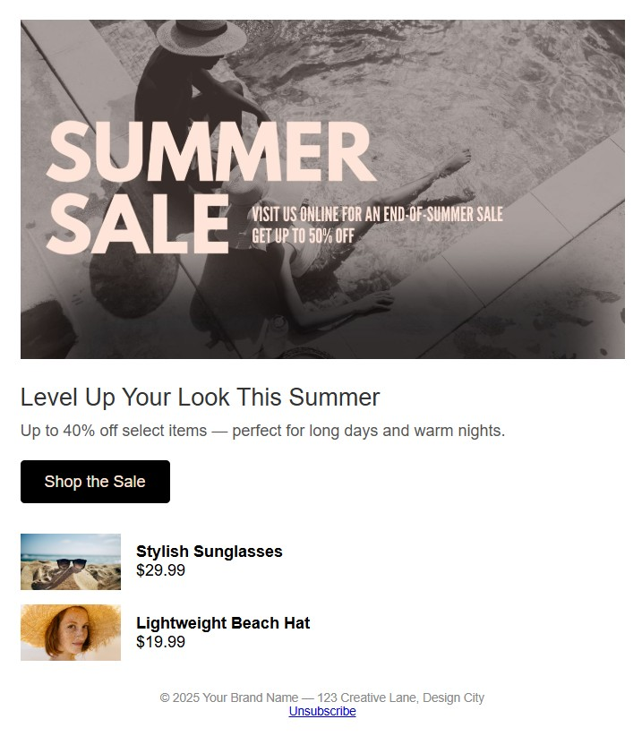

# 🌞 Level Up Summer Sale - HTML Email
A custom-built HTML email crafted for visual punch and clean performance. Hand-coded by me, Lynsie Samani — no builders, no frameworks, just well-structured HTML + CSS.

This layout was made to show how I approach hierarchy, spacing, and mobile responsiveness in email. Great for campaigns that need clarity and conversion.

---

### 🔗 View the Rendered Email  
<a href="https://raw.githubusercontent.com/connectwithlynsie/level-up-summer-email-demo/main/levelUpSummerSale.html" target="_blank" rel="noopener noreferrer">Click to View Full HTML Email</a>

### 💾 View the Code on GitHub  
<a href="https://github.com/connectwithlynsie/level-up-summer-email-demo" target="_blank" rel="noopener noreferrer">Open Repo</a>

---

### 🖼️ Screenshot Preview  

---

### 🧰 Tech Used  
- HTML5  
- CSS (inlined + internal)  
- Mobile-first, responsive layout  
- Tested in browser & code playgrounds  

---

### 👋 Connect With Me  
- <a href="https://www.linkedin.com/in/connectwithlynsie/" target="_blank" rel="noopener noreferrer">LinkedIn</a>  
- <a href="https://github.com/connectwithlynsie" target="_blank" rel="noopener noreferrer">GitHub</a>  
- <a href="https://codepen.io/Lynsie-the-sans" target="_blank" rel="noopener noreferrer">CodePen</a>
